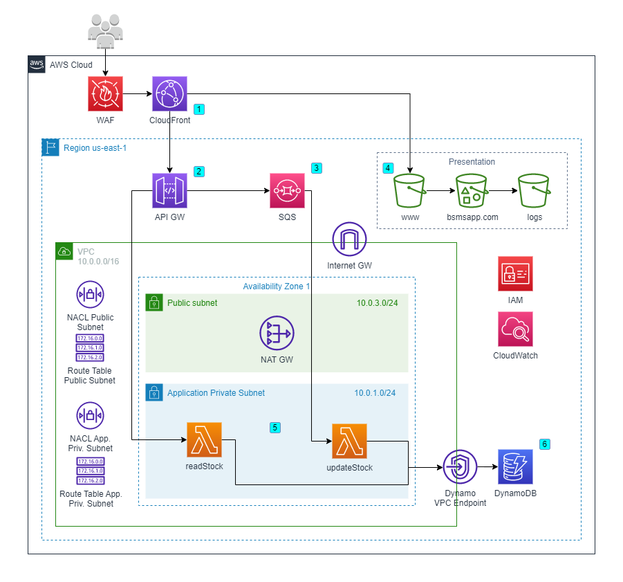

# BSMSapp

Best Stock Management System application.

## Descripción de los módulos

### Api gateway

Recibe pedidos HTTPS. Pueden ser POST o GET. EN el caso de GET, va directo a la lambda de lectura de la tabla. En el caso de POST, se encola en el SQS para luego ir a la lambda.

### Cloudfront

Realiza cache de la API y del S3.

### Dynamo DB

Guarda los datos de los stocks de los usuarios.

### Lambda

Definimos 2 lambdas.
Una se encarga de realizar escrituras al DynamoDB y la otra de realizar lecturas.

### S3

Definimos 3 buckets. Uno para logs y dos para front.

### SQS

Se encarga de encolar POSTs recibidos por la API. Luego dispara la lambda correspondiente

### VPC

Este módulo es [externo](https://registry.terraform.io/modules/terraform-aws-modules/vpc/aws/latest).

## Descripción y referencia de funciones y meta-argumentos

*Los links solo hacen referencia a la primera aparición en cada archivo.*

### Funciones
Junto a cada función se especifica para qué se usa.

> **file**: devuelve como string el contenido del archivo `index.html`. Esto es utilizado para luego poder modificarlo (pues actúa como un template ya que tiene la variable `ENDPOINT` parametrizada) y usarlo.
    > - [organization/datasources.tf](terraform/organization/datasources.tf#L14)

> **flatten**: retorna una lista de una dimensión con los elementos de una lista de listas pues así lo espera el módulo.
    > - [organization/vpc.tf](terraform/organization/vpc.tf#L78)

> **format**: arma el `path` para un filename dado.
    > - [modules/s3/main.tf](terraform/modules/s3/main.tf#L39)

> **jsonencode**: arma un string con un objeto JSON.
    > - [modules/apigw/main.tf](terraform/modules/apigw/main.tf#L89)

> **length**: calcula el largo de `custom_origin_config` para saber si debe hacer un `for_each` sobre sus elementos, es decir, para saber si se lo definieron en el archivo que usa el módulo en cuestión.
    > - [modules/cloudfront/main.tf](terraform/modules/cloudfront/main.tf#L20)

> **lookup**: obtiene el valor de un mapa para una key.
    > - [modules/cloudfront/main.tf](terraform/modules/cloudfront/main.tf#L16)

> **replace**: modifica el `path` para hacerlo válido.
    > - [modules/s3/main.tf](terraform/modules/s3/main.tf#L38)
    > - [organization/cloudfront.tf](terraform/organization/cloudfront.tf#L13)

> **sha1**: computa el `SHA1` del string de la configuración del apigw para saber si se necesita forzar el redeploy del módulo.
    > - [modules/apigw/main.tf](terraform/modules/apigw/main.tf#L103)

> **try**: en caso de que no haya objetos, se utiliza un objeto vacío.
    > - [modules/s3/main.tf](terraform/modules/s3/main.tf#L35)
    > - [organization/s3.tf](terraform/organization/s3.tf#L10)
    

### Meta-argumentos

> **count**
    > - [modules/s3/main.tf](terraform/modules/s3/main.tf#L18)

> **depends_on**
    > - [modules/apigw/main.tf](terraform/modules/apigw/main.tf#L78)
    > - [organization/apigw.tf](terraform/organization/apigw.tf#L8)
    > - [organization/cloudfront.tf](terraform/organization/cloudfront.tf#L3)
    > - [organization/lambda.tf](terraform/organization/lambda.tf#L9)
    > - [organization/sqs.tf](terraform/organization/sqs.tf#L8)

> **for_each**
    > - [modules/cloudfront/main.tf](terraform/modules/cloudfront/main.tf#L12)
    > - [modules/dynamodb/main.tf](terraform/modules/dynamodb/main.tf#L12)
    > - [modules/lambda/main.tf](terraform/modules/lambda/main.tf#L15)
    > - [modules/s3/main.tf](terraform/modules/s3/main.tf#L35)
    > - [organization/lambda.tf](terraform/organization/lambda.tf#L2)
    > - [organization/s3.tf](terraform/organization/s3.tf#L2)

> **lifecycle**
    > - [modules/apigw/main.tf](terraform/modules/apigw/main.tf#L114)

## Diagrama de arquitectura deployada

## Rúbrica

<table>
    <tr>
        <th>Alumno</th>
        <th>Legajo</th>
        <th>Participación</th>
    </tr>
    <tr>
        <td>Bellver, Ezequiel</td>
        <td>61268</td>
        <td>25%</td>
    </tr>
    <tr>
        <td>Burgos, Satiago Eduardo</td>
        <td>55193</td>
        <td>25%</td>
    </tr>
    <tr>
        <td>Lo Coco, Santiago</td>
        <td>61301</td>
        <td>25%</td>
    </tr>
    <tr>
        <td>Oillataguerre, Amparo</td>
        <td>58714</td>
        <td>25%</td>
    </tr>
</table>

## Autores
- Bellver, Ezequiel (61268)
- Burgos, Santiago Eduardo (55193)
- Lo Coco, Santiago (61301)
- Oillataguerre, Amparo (58714)

